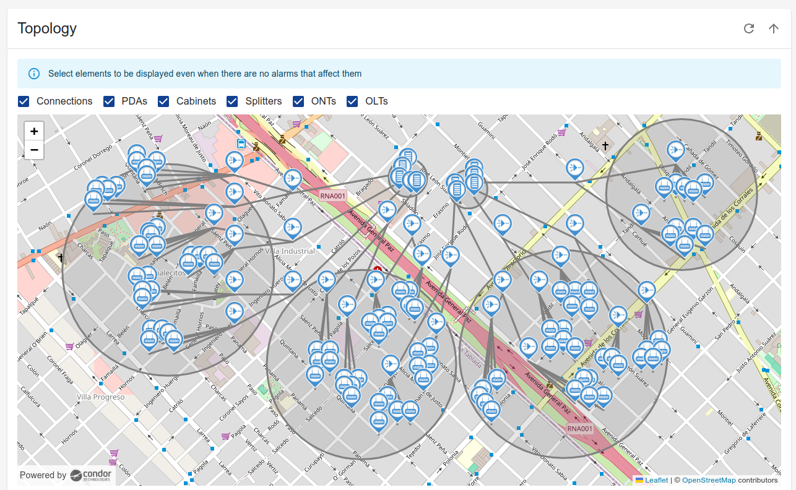
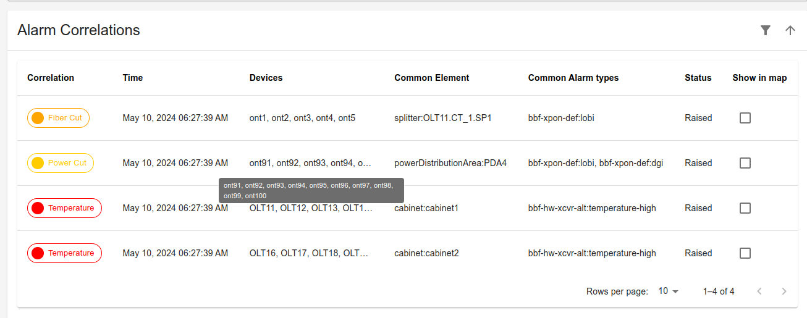
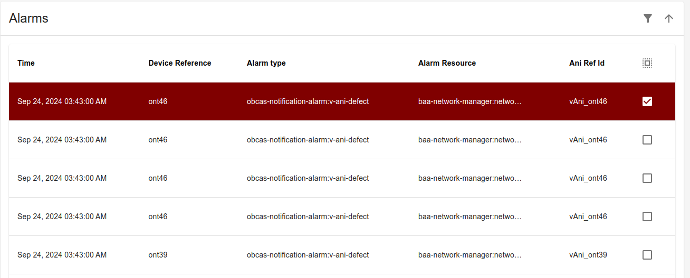

# OB-CAS Alarm Correlation Visualizer 

## Functional Description

This web application allows to show the alarms correlations and the individual alarms in different tables with the possibility to select any of them and visualize on a map that contains the whole topology.

### Topology Map
This section shows a map with the complete topology.

In order to draw the elements on the map, the "obcas-onu-topology" index is first consulted.

For each element of the topology, its coordinates are searched in an external site. Currently they are read from a file that has the element id, for example "ont1", and its longitude and latitude. This file also contains the coordinates of the splitters, power distribution areas, olts and cabinets.

When no correlations or alarms are selected then the elements are shown with its default color as shown in the following image:

 

### Alarm Correlations
This section contains a table with the Correlations created by the application.

The data is obtained from the opensearch "obcas-active-alarms" index. The Visualizer only shows the elements that have the value "obcas:alarm-correlation" in the "alarmType Id" column.

The Column "Show in map" allows to select a correlation and mark the devices and common elements in the topology map with the color of the "Correlation" column. Each possible correlation cause (Fiber cut, Power Cut and High Temperature) is marked with a different color to allow to identify them in an easier way in the map.

 

### Alarms
This section contains a table with the alarms detected.

The data is obtained from the opensearch "obcas-active-alarms" index. The Visualizer only shows the elements that have the value different from "obcas:alarm-correlation" in the "alarmType Id" column.

The Column "Show in map" allows to select an alarm and mark the device in the topology map with 
a dark red color. 

 

## Setting up OB-CAS Alarm Correlation Visualizer Application
Prior to building docker image for the OB-CAS Alarm Correlation Visualizer Application, make sure OB-CAS App environment is setup based on the instructions detailed [here](../obcas_app_environment.md)

### Build OB-CAS SDK Docker Image
~~~
	cd obcas/src/obcas_sdk
	make docker-build
~~~

### Build Docker Images needed for running Alarm Correlation Visualizer App

For Alarm Correlation Visualizer to work properly we need to build two images: nginx-proxy and the Alarm Correlation Visualizesr App itself. Nginx-proxy
for avoiding CORS problems.

### Build OB-CAS Nginx Proxy App Docker Image

~~~  
    cd obcas/src/obcas_apps/visualizer-app/nginx-proxy
	./build-image.sh
~~~

### Build OB-CAS Alarm Correlation Visualizer App Docker Image 

~~~  
    cd obcas/src/obcas_apps/visualizer-app/
	./build-image.sh
~~~

### Start OB-CAS Alarm Correlation Visualizer App using Docker-Compose
- **Pre-Requisites**

   * OB-BAA must be up and running

   * Opensearch and opensearch dashboard applications must be up and running ~/obcas/src/obcas_sdk/opensearch_handler/data/docker-compose.yml

   * OB-CAS Persister App must be up and running as well  ~/obcas/src/obcas_apps/persister/docker-compose.yaml

   * OB-CAS Alarm Correlation App must be up and running as well  ~/obcas/src/obcas_apps/visualizer-app/visualizer-app-compose.yaml

   * Update the Env variable OPENSEARCH_HOST, BAA_SERVER_IP in the corresponding yaml file(s)

   * **Note: Update the correct IP address of OB-BAA, OPENSEARCH containers**

- **Starting OB-CAS Alarm Correlation Visualizer App**

    * Navigate to the directory **cd /obcas/src/obcas_apps/visualizer-app/**

    * Execute the command to start docker container **docker-compose -f visualizer-app-compose.yaml up**

    * **Note:If you want to run the app on the background use -d flag**

- **Accessing the visualizer**

    * To access this application you must open a web browser and access to the url: https://SERVER_IP/alarms-correlation

[<--Back to the Applications Overview](../index.md)
