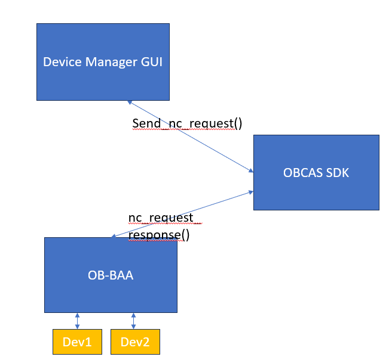
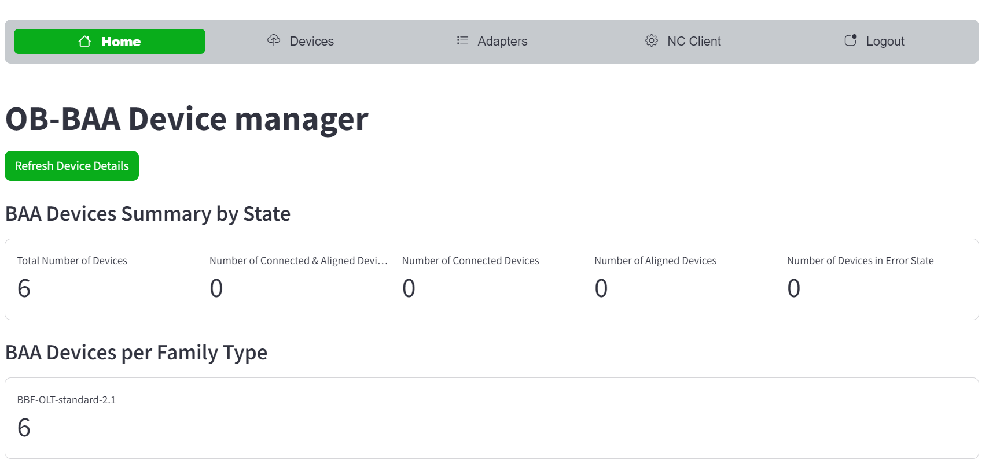
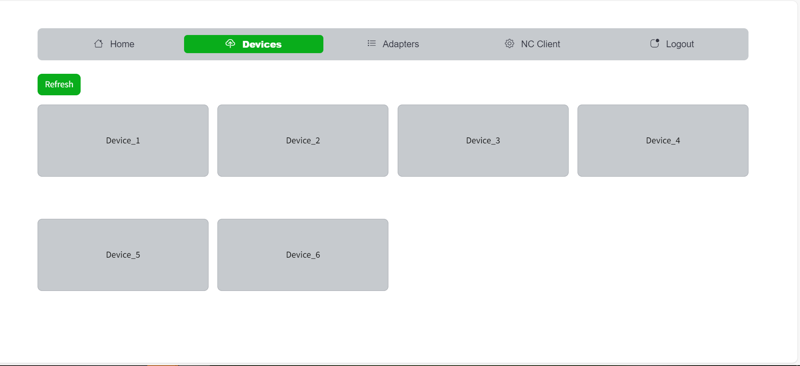
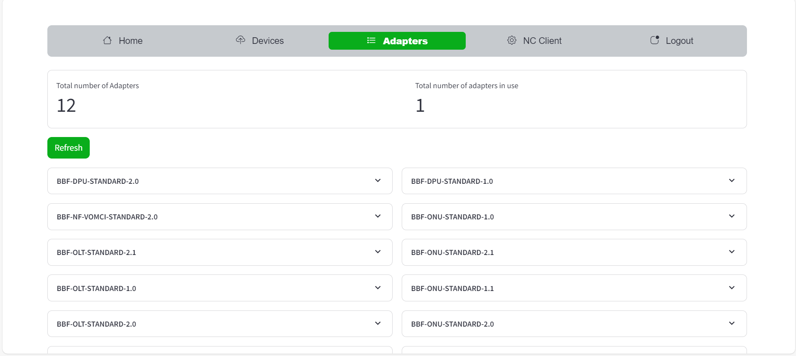
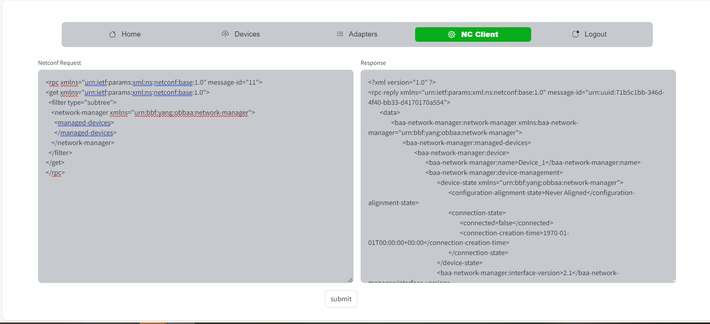

# OB-CAS Device Manager UI 

## Functional Description

The Device Manager UI app is built using the streamlit framework based on python, and simply shows which 
devices are under control of the OB-BAA platform and which status these have, as well as the adapters being supported by the OB-BAA.

Its internal operation is straightforward. The OB-BAA device manager UI app

* invokes the obcas sdk code(send_nc_request()) to connect to the OB-BAA NC server.
* gets the response from OB-BAA server via the nc_client response.
* parses the response and populate the information in UI representation (streamlit).

 

Shown below are some screenshot from the UI environment:

 

 

 

 

<a id="env" />

## Setting up OB-CAS BAA Device Manager Application
Prior to building docker image for the OB-CAS BAA Device Manager Application, make sure OB-CAS App environment is setup based on the instructions detailed [here](../obcas_app_environment.md)

### Build OB-CAS SDK Docker Image
~~~
	cd obcas/src/obcas_sdk
	make docker-build
~~~

### Build OB-BAA Device Manager Docker Image
~~~  
    cd obcas/src/obcas_apps/baa_device_manager/
	make docker-build
~~~

### Start OB-BAA Device Manager App using Docker-Compose
- **Pre-Requisites**

  1) OB-BAA must be up and running 
  2) Update the Env variable BAA_SERVER_IP in ~/obcas/src/obcas_apps/baa_device_manager/docker-compose.yaml
  Note: 
      Update the correct IP address of OB-BAA container

- **Starting BAA Device Manager app**

  1) Navigate to baa_device_manager directory 'cd obcas/src/obcas_apps/baa_device_manager'
  2) Run the command 'docker-compose up -d'

- **Launching BAA Device Manager app**

  1) Launch any Browser
  2) open the URL 'http://<IP_ADDRESS>:8501'

    Note: 
    IP_ADDRESS = ip address of the server/machine where the baa_device_manager app is running

[<--Back to the Applications Overview](../index.md)