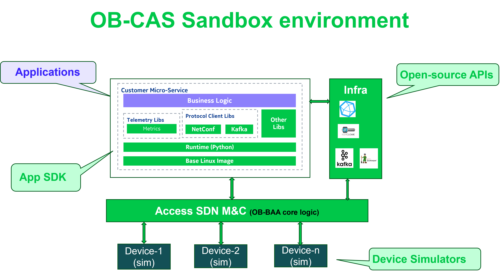

<a id="overview" />

# OB-CAS Overview

The objective of the Open Broadband-CloudCO Application Software Development Kit (OB-CAS) project
is to lower the barriers for developers to embed their software applications in a CloudCO/access 
management environment, creating a network management application ecosystem for the broadband industry.

Building on existing open source standards and projects, this initiative will help operators automate
operations, as envisioned in TR-486, Automated and Intelligent Management. Its open nature allows service
providers to utilize the existing CloudCO operating environment, facilitate multi-vendor operation 
and choose best-of-breed solutions to optimize their operations.

Software application providers can integrate their cloud application running in a CloudCO environment. 
These applications can analyse -with optional support from AI -the network telemetry data that is 
accessible  from the access domain controller via well-defined APIs. The processing of this data and 
the associated recommendations can result in improved user experience, reduced OPEX, or increased ARPU 
for the network operator.

Next to the development of the App SDK and its sandbox environment, the project team also
develops (sample) applications which can be used as the basis by other OB-CAS members for other 
more complex apps, targeting a commercial deployment in production networks. 

In short,  OB-CAS is set to create a network management application ecosystem for the 
broadband industry to foster open innovation. OB-CAS defines a set of open-source 
APIs through which applications can access infrastructure resources and telemetry data made available
via an access controller and also provides for a sandbox environment consisting of the App SDK, 
network device simulators and a reference access domain controller platform based on OB-BAA reference 
implementation.

# OB-CAS System Architecture

From a high level perspective, the main requirements for applications in the context of OB-CAS can 
be listed as:

* Should remain lightweight without operator need to worry about the full-fledged life-cycle management of individual apps. Take advantage of cloud native architecture principles to host the apps in existing operating environment of CloudCO components (e.g. Domain controller).
* Should be hot deployable across different vendors operating environment. This can be realized by standardizing/blue print interfaces of the hosting environment.
* For faster time to market & easier maintenance, the app development should be restricted to business logic for realizing its objective. It can reuse components from the hosting platform. The components could be:
  + Infrastructure components (e.g. datastores, messaging systems, authentication modules)
  + Functional components (e.g. Collection functions IPFix collectors, PMA for network inventory)
* Should be encapsulated as much as possible from vendor/technology specifics.

The figure below shows the app realized through its business logic running on top of a domain controller, and with which it integrates with selected APIs (shown is when the app would run on top of the core OB-BAA SW layer)

 

The table below shows the current (March 2025) APIs that make up the OB-CAS SDK

| **Handler**          | **API/Technology** | **OB-CAS release** |
|----------------------|--------------------|--------------------|
| Message Bus          | **KAFKA**          | *1.0.0*            |
| Logging              | **FluentD**        | *1.0.0*            |
| DB, index and search | **Open Search**    | *1.0.0*            |
| Time series DB       | **Open TSDB**      | WIP: *2.0.0*       |
| YANG DS API          | **NC client**      | *1.0.0*            

The description of the APIs can be found [here](../../index.md#introduction)

An overview of the applications developed and currently available can be found [here](../../apps/overview.md#overview)

[<--Introduction](../../index.md#introduction)

[APIs -->](../apis/apis.md)
