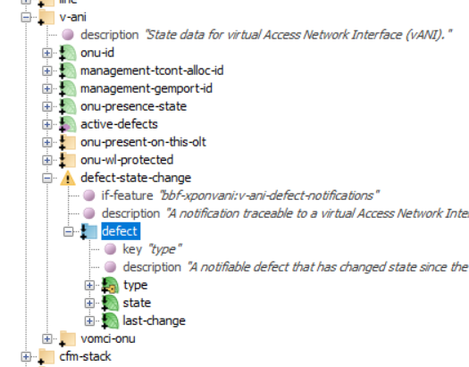
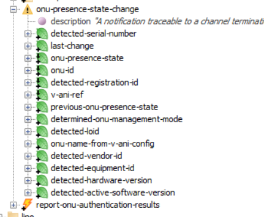
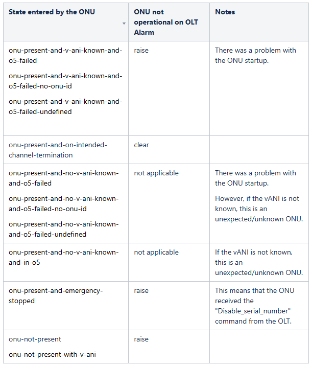

# PON Simulator

In order to demonstrate the OB-CAS applications (such as alarm correlation application), 
a PON network can be simulated in the OB-BAA environment as part of the OB-CAS sandbox, 
where a given number of ONU simulators and OLT simulators are instantiated and configured through OB-BAA.

##  Requirements PON simulator for alarm correlation application 
In order to demonstrate the alarm correlation application, the simulation environment should meet the following requirements.

* It simulates hundreds of ONUs and tens of OLTs.
* ONUs should be from few different vendors. (This can be done by updating the corresponding attributes of specific ME instances configured in the ONU simulators).
* Multiple channel terminations (channel groups) should be configured in each OLT, through which different ONUs are connected to that OLT.
* Preferably, there are few instances of vOMCI functions, each one managing a set of ONUs.
  * ONUs and OLTs, belonging to specific categories, are raising alarms, in such a way that few correlations 
  can be identified by the alarm correlation application. For example:
  * All ONUs of a specific vendor raise a (valid) alarm
  * All ONUs connected to a specific channel group raise a (dying-gasp) alarm
  * All ONUs connected to a specific splitter raise a (dying-gasp) alarm. 
  The info which ONUs are connected to which splitters should be provided to (or by) the PON simulator (this information then needs to be added to the corresponding OpenSearch index).
  * All OLTs placed in a specific server room raise a (temperature) alarm. The info which OLTs are placed in which server room or cabinet  should be provided to (or by) the PON simulator (this information then needs to be added to the corresponding OpenSearch index)
  
* Some of the alarms are cleared after a while, in such a way that some correlations which were already identified (raised) by the alarm correlation application  
disappear (get cleared).

## Implementation of PON simulator for alarm correlation application

From the perspective of the alarm correlation application,  the PON simulator should result in either generation of alarms or generation of defect notifications 
issued by the OB-BAA (by a certain OLT port and -when applicable - for a certain ONU).

The way this is achieved is by having multiple NETCONF servers (representing each an OLT simulator, as developed in the OB-BAA project)  sending these alarms/notifications towards the OB-BAA SB interface.  A (flexible) script can be created that defines which alarm (alarm type from which OLT port) and which defect notification (from which OLT port for which ONU) is sent when.  The script  could have as baseline a random generation of alarms/defect notifications , but with an overlay of alarm/event generation that effectively represent a real situation that leads towards alarm correlation.

These OLT simulators have an API that can be driven by a script, simulating events taking place in the (simulated) network.


## Exteral PON topology information

The PON simulator/script needs to be aware of external PON topology information, such as which ONUs are connected to which splitters, 
or which OLTs are located in which locations. This way, the PON simulator can raise "valid" alarms from devices that can be correlated. 
For example, it can raise dying gasp alarms from all ONUs connected to the same splitter, reflecting that there is a power problem in the area. 
As another example, it can raise temperature alarms from all OLTs located in the same location, reflecting that there is problem with cooling system in the given 
location.

## Correlation use-cases and associated alarms

### Detection of fiber cut
Conditions:

* All ONUs connected to a specific channel group change the state to "not-present" and there is no dying gasp raised
* All ONUs connected to a specific splitter raise a change the state to  "not-present" and there is no dying gasp raised

Note: ITU-T G.984.3 (01/2014) 11.1.1 defines a LOSi alarm when "No valid optical signal from ONU when it was expected during 4 consecutive non-contiguous allocations to that ONU.", but it is not defined in bbf-xpon-defects.yang

### Detection of power outage in a given area
Conditions:

* All ONUs connected to a specific channel group change the state to "not-present" and raise a dying gasp
* All ONUs connected to a specific splitter raise a change the state to  "not-present" and raise a dying gasp

Note: ITU-T G.984.3 (01/2014) 11.1.1 defines a LOSi alarm when "No valid optical signal from ONU when it was expected during 4 consecutive non-contiguous allocations to that ONU.", but it is not defined in bbf-xpon-defects.yang

### Problem with a specific vOMCI function
Condition:

* A notification is received from OB-BAA with an "aligment error" condition for a set of ONUs using the same vOMCI function ?

### Air conditioning system malfunction on a given room
Condition:

* All OLTs placed in a specific server room raise a (temperature) alarm


## Alarms and Notifications

### Dying Gasp
An ONU sends a Dying Gasp when there is a Loss of Power. If a set of ONUs from a given area send Dying Gasps almost simultaneously, this probably means that there was a power outage.

Currently there are no standard Alarm Type Ids defined for Dying Gasp (at least in the OB-BAA context). However, there are NETCONF notifications that convey this information.

The module bbf-xponvani defines a set of defects applicable to v-ANIs. Each time a defect is changes state (active/inactive) a notification is sent.


<p align="center">
 
</p>


#### Raise Dying Gasp

```
<notification xmlns="urn:ietf:params:xml:ns:netconf:notification:1.0">
  <if:interfaces-state xmlns:if="urn:ietf:params:xml:ns:yang:ietf-interfaces">
    <if:interface>
      <if:name>van1</if:name>
      <bbf-xponvani:v-ani xmlns:bbf-xponvani="urn:bbf:yang:bbf-xponvani">
        <bbf-xponvani:defect-state-change>
          <bbf-xponvani:defect>
            <bbf-xponvani:type>bbf-xpon-def:dgi</bbf-xponvani:type>
            <bbf-xponvani:state>raised</bbf-xponvani:state>
            <bbf-xponvani:last-change>2024-01-01T00:00:00Z</bbf-xponvani:last-change>
          </bbf-xponvani:defect>
        </bbf-xponvani:defect-state-change>
      </bbf-xponvani:v-ani>
    </if:interface>
  </if:interfaces-state>
</notification>
```


#### Clear Dying Gasp

```
<notification xmlns="urn:ietf:params:xml:ns:netconf:notification:1.0">
  <if:interfaces-state xmlns:if="urn:ietf:params:xml:ns:yang:ietf-interfaces">
    <if:interface>
      <if:name>van1</if:name>
      <bbf-xponvani:v-ani xmlns:bbf-xponvani="urn:bbf:yang:bbf-xponvani">
        <bbf-xponvani:defect-state-change>
          <bbf-xponvani:defect>
            <bbf-xponvani:type>bbf-xpon-def:dgi</bbf-xponvani:type>
            <bbf-xponvani:state>cleared</bbf-xponvani:state>
            <bbf-xponvani:last-change>2024-01-01T00:00:00Z</bbf-xponvani:last-change>
          </bbf-xponvani:defect>
        </bbf-xponvani:defect-state-change>
      </bbf-xponvani:v-ani>
    </if:interface>
  </if:interfaces-state>
</notification>
```

Other defects include:  lobi, tiwi, dfi, lopci, looci, dowi, sfi, sdi, lcdgi, rdii, loai, dgi, memi, misi, peei, loki. See bbf-xpon-defects.yang for reference.

## ONU state change notification
Whenever an OLT detects a change of state an ONU, an "onu-presence-state-change" notification is sent. This notification is defined by bbf-xpon-onu-state.yang

<p align="center">
 
</p>

Some examples:
#### ONU has become online and has a matching v-ANI (is operational)
```
<notification xmlns="urn:ietf:params:xml:ns:netconf:notification:1.0">
  <eventTime>2019-07-25T05:53:36+00:00</eventTime>
    <if:interfaces-state xmlns:if="urn:ietf:params:xml:ns:yang:ietf-interfaces" xmlns:bbf-xpon-onu-types="urn:bbf:yang:bbf-xpon-onu-types">
    <if:interface>
      <if:name>CT_1</if:name> 
      <bbf-xpon:channel-termination xmlns:bbf-xpon="urn:bbf:yang:bbf-xpon"> 
        <bbf-xpon-onu-s:onu-presence-state-change xmlns:bbf-xpon-onu-s="urn:bbf:yang:bbf-xpon-onu-state">        
          <bbf-xpon-onu-s:detected-serial-number>ABCD12345678</bbf-xpon-onu-s:detected-serial-number>
          <bbf-xpon-onu-s:last-change>2023-05-05T00:00:00Z</bbf-xpon-onu-s:last-change>
          <bbf-xpon-onu-s:onu-presence-state>bbf-xpon-onu-types:onu-present-and-on-intended-channel-termination</bbf-xpon-onu-s:onu-presence-state>
          <bbf-xpon-onu-s:onu-id>25</bbf-xpon-onu-s:onu-id>
          <bbf-xpon-onu-s:detected-registration-id>0000000000</bbf-xpon-onu-s:detected-registration-id>
          <bbf-xpon-onu-s:previous-onu-presence-state>bbf-xpon-onu-types:onu-not-present</bbf-xpon-onu-s:previous-onu-presence-state>
        </bbf-xpon-onu-s:onu-presence-state-change>
      </bbf-xpon:channel-termination>
    </if:interface>
   </if:interfaces-state>
</notification>
```
#### ONU has become offline (the OLT cannot communicate with it) Expand source

```

<notification xmlns="urn:ietf:params:xml:ns:netconf:notification:1.0">
  <eventTime>2019-07-25T05:53:36+00:00</eventTime>
    <if:interfaces-state xmlns:if="urn:ietf:params:xml:ns:yang:ietf-interfaces" xmlns:bbf-xpon-onu-types="urn:bbf:yang:bbf-xpon-onu-types">
    <if:interface>
      <if:name>CT_1</if:name> 
      <bbf-xpon:channel-termination xmlns:bbf-xpon="urn:bbf:yang:bbf-xpon"> 
        <bbf-xpon-onu-s:onu-presence-state-change xmlns:bbf-xpon-onu-s="urn:bbf:yang:bbf-xpon-onu-state">        
          <bbf-xpon-onu-s:detected-serial-number>ABCD12345678</bbf-xpon-onu-s:detected-serial-number>
          <bbf-xpon-onu-s:last-change>2023-05-05T00:00:00Z</bbf-xpon-onu-s:last-change>
          <bbf-xpon-onu-s:onu-presence-state>bbf-xpon-onu-types:onu-not-present</bbf-xpon-onu-s:onu-presence-state>
          <bbf-xpon-onu-s:onu-id>25</bbf-xpon-onu-s:onu-id>
          <bbf-xpon-onu-s:detected-registration-id>0000000000</bbf-xpon-onu-s:detected-registration-id>
          <bbf-xpon-onu-s:previous-onu-presence-state>bbf-xpon-onu-types:onu-present-and-on-intended-channel-termination</bbf-xpon-onu-s:previous-onu-presence-state>
        </bbf-xpon-onu-s:onu-presence-state-change>
      </bbf-xpon:channel-termination>
    </if:interface>
   </if:interfaces-state>
</notification>
```

For the purpose of the correlation app, these notifications could be mapped to a customized internal alarm called for example "ONU not operational on OLT". 
The following table shows a possible mapping between the ONU state received in the notifications, and this alarm.


<p align="center">
 
</p>
Table : Mapping "ONU state change notification" to equivalent  raise/clear of "ONU not operational on OLT" internal alarm

## Temperature Alarms

### Transceiver temperature high - raise
```
<notification xmlns="urn:ietf:params:xml:ns:netconf:notification:1.0">
  <eventTime>2024-08-01T15:04:05Z</eventTime>
  <al:alarm-notification xmlns:al="urn:ietf:params:xml:ns:yang:ietf-alarms">
   <al:resource xmlns:hw="urn:ietf:params:xml:ns:yang:ietf-hardware">/hw:hardware/hw:component[hw:name='transceiver1']</al:resource>
   <al:alarm-type-id xmlns:bbf-hw-xcvr-alt="urn:bbf:yang:bbf-hardware-transceiver-alarm-types">bbf-hw-xcvr-alt:temperature-high</al:alarm-type-id>
   <al:alarm-type-qualifier></al:alarm-type-qualifier>
   <al:time>2024-08-01T15:04:05Z</al:time>
   <al:perceived-severity>major</al:perceived-severity>
   <al:alarm-text>The internal temperature has exceeded the high level</al:alarm-text>
  </al:alarm-notification>
</notification>
```
### Transceiver temperature high - clear
```
<notification xmlns="urn:ietf:params:xml:ns:netconf:notification:1.0">
  <eventTime>2024-08-01T15:04:05Z</eventTime>
  <al:alarm-notification xmlns:al="urn:ietf:params:xml:ns:yang:ietf-alarms">
   <al:resource xmlns:hw="urn:ietf:params:xml:ns:yang:ietf-hardware">/hw:hardware/hw:component[hw:name='transceiver1']</al:resource>
   <al:alarm-type-id xmlns:bbf-hw-xcvr-alt="urn:bbf:yang:bbf-hardware-transceiver-alarm-types">bbf-hw-xcvr-alt:temperature-high</al:alarm-type-id>
   <al:alarm-type-qualifier></al:alarm-type-qualifier>
   <al:time>2024-08-01T15:04:05Z</al:time>
   <al:perceived-severity>cleared</al:perceived-severity>
   <al:alarm-text>The internal temperature has exceeded the high level</al:alarm-text>
  </al:alarm-notification>
</notification>
```
## OB-BAA pOLT Simulator for generating defect-state-change notifications

The OB-BAA pOLT Simulator supports an API for generating defect-state-change notifications. This API is available in OB-BAA R.6.0.1.

```
docker pull broadbandforum/obbaa-polt-simulator:develop
```

The REST API was extended with following command:

### REST API for defect-state-change notification
```
POST http://<simulator_ip>:<simulator_rest_api_port>/polt/polt_actions
Body:
{
  "requests":
  [
    {
            "v-ani": "<vani_name>",
            "action": "ONUALARM",
            "type": "<alarm>",
            "state": "<state>"
    }
  ]
}
```
 where:
 * vani_name = The name of the vANI where to generate the defect  (eg.: vAni_ont1)
 * simulator_ip = IP address of the pOLT simulator
 * simulator_rest_api_port = pOLT Simulator REST API port (default is 3001)
 * alarm = The defect to generate; any notification with an identity derived from items-detected-at-olt-for-v-ani can be used (eg.: bbf-xpon-defects:lobi)
 * state = raised OR cleared
 

## OB-BAA pOLT Simulator for generating ietf-alarm notifications

The OB-BAA pOLT Simulator supports an API for generating ietf-alarms notifications. This API is available in OB-BAA R.6.0.1.

The REST API was extended with following command:

### REST API for defect-state-change notification

```
POST http://<simulator_ip>:<simulator_rest_api_port>/polt/polt_actions
Body:
{
"requests":
[
{
"resource": "<resource>",
"action": "IETFALARM",
"type-id": "<type-id>",
"type-qualifier": "<type-qualifier>",
"severity": "<severity>",     
"text": "<text>"        
}
]
}
```
where:

* resource = The name of the resource  (eg.: /ietf-hardware:hardware/component[name='transceiver1'])
* simulator_ip = IP address of the pOLT simulator
* simulator_rest_api_port = pOLT Simulator REST API port (default is 3001)
* type-id = The alarm to generate. Any alarm with an identity derived from ietf-alarms:alarm-type-id can be used (as long as the corresponding YANG module is loaded in the simulator).
Note: the prefix of the identity is the YANG module name. (eg.: bbf-hardware-transceiver-alarm-types:temperature-high)
* type qualifier = The alarm-type-qualifier to send in the notification. Usually it's an empty string
* severity = The severity value. Possible values: minor, warning, major, critical, cleared
* text = Free text describing the alarm

## Adapter for pOLT simulator and ietf-alarms
Currently the pOLT simulator (OB-BAA R6.0.1) generates alarms with some prefixes missing. In the example below the hw prefix is not defined:

```
<notification xmlns="urn:ietf:params:xml:ns:netconf:notification:1.0">
  <eventTime>2024-08-01T15:04:05Z</eventTime>
  <al:alarm-notification xmlns:al="urn:ietf:params:xml:ns:yang:ietf-alarms">
   <al:resource>/hw:hardware/hw:component[hw:name='transceiver1']</al:resource>
   <al:alarm-type-id xmlns:bbf-hw-xcvr-alt="urn:bbf:yang:bbf-hardware-transceiver-alarm-types">bbf-hw-xcvr-alt:temperature-high</al:alarm-type-id>
   <al:alarm-type-qualifier></al:alarm-type-qualifier>
   <al:time>2024-08-01T15:04:05Z</al:time>
   <al:perceived-severity>cleared</al:perceived-severity>
   <al:alarm-text>The internal temperature has exceeded the high level</al:alarm-text>
  </al:alarm-notification>
</notification>
```

This causes an exception on OB-BAA side.

As a workaround, a device adapter was developed to fix the alarm notifications (available in the OB-BAA source code). The .kar file is available here:

https://wiki.broadband-forum.org/download/attachments/349995109/BBF-OLT-simulator-2.2.kar?version=1&modificationDate=1726490444291&api=v2


<--[Apps ](../../apps/overview.md)

--> [Demonstrations ](../../demonstrations/alarm_correlation/index.md)
